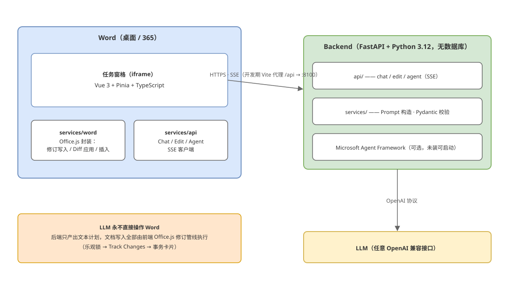

# Word AI Copilot

Word 任务窗格 AI 助手：在 Microsoft Word 中与 AI 对话（基于选区 / 段落 / 章节 / 全文上下文），
并让 AI 直接修改文档 —— 所有修改以 **Word 原生修订（Track Changes）** 写入，
可逐条接受 / 拒绝 / 重新生成，与人工修订完全隔离。

## 为什么开发这个插件

市面上的 Word AI 插件大多是「生成 → 粘贴」式的，用起来总有几个绕不开的问题：

- **改了什么看不清**：AI 直接替换整段甚至整篇内容，用户面对一整块新文本，
  不知道哪里被动了；想只采纳一半，只能手工比对。
- **出错不可逆**：有的工具让模型输出 OOXML 或整段重写后直接覆盖文档。模型
  幻觉、漏内容、破坏格式时，损失无法挽回 —— 而 LLM 恰恰是会出错的。
- **信任边界缺失**：AI 修改与人工修订混在一起，接受 AI 的改动可能顺带把
  自己或同事的修订一起吞掉。
- **隐私一刀切**：为了「全文档理解」，无论任务大小都整篇上传 —— 哪怕只是
  要润色选中的一句话。

本项目想回答一个问题：**AI 能不能像一个人类协作者那样改 Word 文档？**
人类协作者的规范早就存在 —— Word 修订（Track Changes）：改哪里一目了然、
逐条接受或拒绝、不动别人的修订。Word AI Copilot 把 AI 的编辑权约束进同一套规范：

- AI 的每次修改都以 **Word 原生修订** 写入，与人工修订完全隔离
- 每次修改是一个独立事务（编辑卡片），逐条接受 / 拒绝 / 重新生成
- 应用前做乐观锁校验，文档已变化就拒绝 —— **绝不静默覆盖**
- **LLM 永远碰不到 Word 对象**：模型只产出文本计划，写入由前端校验管线执行
- 只发送任务所需内容，聊天区明示 AI 读取了什么

## 它能做什么

**对话**：基于选区 / 段落 / 章节 / 全文上下文与 AI 交流，不改文档。

**单段修改（Edit 通道）**：对选中文字做润色 / 专业化 / 纠错 / 翻译并替换等，
走 `原文本 + 新文本` 的 Diff 管线。

**Agent 模式**：读全文快照、问答，并可提交六类结构化提案
（同样走修订与事务卡片管线）：

- **整段替换** `propose_edit` —— 原文本 + 新文本 + 摘要
- **格式修改** `propose_format` —— 加粗、斜体、下划线、删除线、字体、字号、
  颜色、对齐（整段级别）
- **插入表格** `insert_table` —— TableGrid 样式、表头行
- **插入标题章节** `insert_heading` —— 标题 1～9，进入导航窗格与自动目录
- **插入数学公式** `insert_formula` —— LaTeX → OMML，Word 原生公式对象，可双击编辑
- **插入纯文字段落** `insert_paragraph` —— 换行分段

插入类内容可落在锚点段之后或**文档末尾**（锚点可省略 —— 空文档也能直接生成内容，
如「帮我画一个表格」「随便写两段简介」）。

## 安全设计原则

- **LLM 永不直接操作 Word**：`LLM → EditPlan → 校验 → Diff → Patch → Office.js → Track Changes`
  （agent 模式同理：`Agent → 工具提案 → 逐条独立管线`）
- **绝不静默覆盖文档**：AI 修改全部经由修订（Track Changes）写入
- **修订隔离**：每次修改是一个事务（Content Control 边界），接受 / 拒绝只作用于该事务，
  绝不调用文档级 acceptAll —— 人工修订不受影响
- **乐观锁**：应用修改前校验目标文本哈希（SHA-256），文档变化即拒绝（`DOCUMENT_CHANGED`）
- **Diff 在客户端计算**：后端只返回 `original_text / new_text`，
  字符级差异（diff-match-patch）在任务窗格内计算并从后向前应用
- **隐私**：只发送完成请求所需的文档内容（选区 / 段落模式不发送全文），UI 明示 AI 读取范围
  （agent / @document 模式发送全文快照，发送前在聊天区披露段数与字数）
- **取消即无副作用**：Agent 运行中点「停止」，已收到的提案全部丢弃，文档无任何变化（§58）

## 架构



（可编辑源文件：`docs/architecture.drawio`，用 [diagrams.net](https://app.diagrams.net) 打开）

- **前端**（`frontend/`，Vue 3 + Pinia + TypeScript）：Word 任务窗格，
  封装全部 Office.js 操作（修订写入 / Diff 应用 / 插入）与 SSE 客户端
- **后端**（`backend/`，FastAPI + Python 3.12，无数据库）：chat / edit / agent
  接口、Prompt 构造与 Pydantic 校验；Microsoft Agent Framework 可选
- **LLM**：任意 OpenAI 兼容接口

关键约束：**后端只产出文本计划，所有对 Word 的操作都在前端执行** ——
`LLM → EditPlan → 校验 → Diff → Patch → Office.js → Track Changes`，
Agent 提案同理，逐条独立走该管线后生成事务卡片。

## 快速开始

### 环境要求

- **Node.js ≥ 22**（含 npm）
- **Python ≥ 3.12**（Windows 下用 `py` 启动器）
- **Microsoft Word**：桌面版 Microsoft 365（修订功能需要 **WordApi 1.6**；
  不满足时任务窗格自动降级为「仅对话」，不抛异常）
- 操作系统：Windows 10 / 11（sideload 流程以 Windows Word 桌面版为准）

### 安装依赖

```bash
# 前端
cd frontend
npm install

# 后端
cd ../backend
py -m pip install -r requirements.txt

# 生成 manifest 图标（一次性）
cd ../frontend && npm run icons

# 生成测试文档（一次性，可选）
cd ..
py -m pip install python-docx
py tools/generate_test_documents.py
```

### HTTPS 证书

Office Add-in 的任务窗格在 Word 中以 HTTPS iframe 加载，开发期使用
[office-addin-dev-certs](https://www.npmjs.com/package/office-addin-dev-certs) 提供的
可信 localhost 证书（首次执行会请求管理员权限并把证书装入本机受信存储）：

```bash
cd frontend
npm run dev-certs     # 安装 localhost 开发证书
```

证书就绪后 `npm run dev` 会自动以 `https://localhost:3000` 启动；
若证书未安装，Vite 会退回 HTTP 并打印警告（此时 Word 无法加载任务窗格）。

### 启动 Backend

```bash
cd backend
# 1. 准备配置
copy .env.example .env      # 然后编辑 .env 填入 LLM_API_KEY 等（见「LLM 配置」）

# 2. 启动（二选一；端口 8100 —— 本机 8000 常被其他服务占用）
py -m uvicorn app.main:app --reload --port 8100
py run.py
```

健康检查：`curl http://localhost:8100/api/v1/health`
（或直接在任务窗格「设置」里点「保存并测试」）。

### 启动 Frontend

```bash
cd frontend
BACKEND_PORT=8100 npm run dev  # https://localhost:3000，/api 代理到 http://localhost:8100
```

Vite 已把 `/api/*` 反向代理到本地 FastAPI（默认 8100，`BACKEND_PORT` 环境变量可改），
避免 https 任务窗格访问 http 后端的混合内容问题 —— 任务窗格内后端地址保持留空即可。

### Skill 配置后台

后端启动后访问 [http://localhost:8100/admin/skills](http://localhost:8100/admin/skills)。
管理页支持新建、编辑、启用/停用和删除 Skill。每个 Skill 包含：

- 名称与说明；
- 触发词（逗号分隔；留空表示所有请求均加载）；
- 注入聊天及 Agent 系统提示词的工作指令；
- 启用状态。

配置默认保存在 `backend/data/skills.json`（已加入 `.gitignore`）。如需指定其他
位置，可设置环境变量 `SKILL_STORE_PATH`。管理接口为 `GET/POST /api/v1/skills`
及 `PUT/DELETE /api/v1/skills/{id}`。

## Sideload 到 Word

```bash
cd frontend
npm run sideload         # 注册到 Word 开发目录（用户级注册表，持久）
npm run sideload:word    # 直接启动 Word 并加载插件（可选，也可手动开 Word）
```

**注意**：`sideload:word` 通过打开一个内嵌 webextension 引用的模板文档来激活插件。
不要给它追加 `-d <文档>` 参数——传了文档后工具只会原样复制该文档（不注入插件引用），
插件不会被加载。想打开自己的测试文档，等插件激活后在 Word 里正常打开即可。

然后：完全退出 Word → 重新打开 Word → 功能区「开始」选项卡 →
「AI 助手」分组 → 点击按钮打开任务窗格。

移除 sideload：

```bash
npm run unsideload       # office-addin-dev-settings unregister manifest.xml
```

## 分发给其他用户（deploy/）

想让别人也用上这套插件、而前后端都跑在你自己电脑上时，**分发的唯一文件是一个
manifest.xml**（Word 只是按 manifest 里的地址从你的机器加载任务窗格网页）。
`deploy/` 目录提供生成与分发工具：

```bash
py deploy\make_manifest.py --base https://你的机器名:端口   # 产出 deploy\dist\manifest.xml
```

脚本把 manifest 中全部本机开发地址替换为你的对外 HTTPS 源（任务窗格与 API
须同一源，避免混合内容）；使用者通过**共享文件夹受信目录**（零命令行）或
`office-addin-dev-settings register` 安装。前置条件（HTTPS 源、CORS、
证书信任、隐私告知）与完整步骤见 [deploy/README.md](deploy/README.md)。

### 任务窗格没出现时的排查（运行时日志）

Word 会**静默丢弃**解析失败的 manifest（功能区不出现按钮、也不弹错）。
开启运行时日志可以看到真实原因：

```bash
npx office-addin-dev-settings runtime-log --enable "%TEMP%\office-runtime.log"
# 复现问题后查看日志；关闭：
npx office-addin-dev-settings runtime-log --disable
```

本项目曾踩过的坑：VersionOverrides 里 Word 的 Host 元素必须是
`<Host xsi:type="Document">`（不是 `DocumentHost`）；
资源字符串必须分 `<bt:ShortStrings>`（≤125 字符）和 `<bt:LongStrings>`（≤250 字符），
不存在单一的 `<bt:Strings>`。

### Manifest 关键配置

`frontend/manifest.xml`：

- `Id`：插件唯一 GUID（换新插件身份时重新生成）
- `Resources`/`bt:Url`：任务窗格地址，当前为 `https://localhost:3000/taskpane.html`
  （部署时改为生产域名，须 HTTPS）
- 图标：`assets/icon-16/32/80.png`（`npm run icons` 生成的占位图可直接替换）
- **有意未声明 WordApi Requirements**：声明后旧版 Word 会直接拒绝加载插件；
  本项目选择运行时能力探测（`WordApi 1.6`）+ 优雅降级（仅对话），
  见 `frontend/src/services/word/WordService.ts`

## LLM 配置

`backend/.env`（任何 OpenAI 兼容接口均可）：

```ini
LLM_PROVIDER=openai                       # 仅作展示名；协议统一为 OpenAI Compatible
LLM_BASE_URL=https://api.openai.com/v1    # DeepSeek: https://api.deepseek.com/v1
LLM_API_KEY=sk-xxxx
LLM_MODEL=gpt-4o-mini

# 可选
LLM_TIMEOUT_SECONDS=120        # 对话流式超时
LLM_EDIT_TIMEOUT_SECONDS=60    # Edit 生成超时
LLM_TEMPERATURE=0.3
LLM_MAX_TOKENS=2048

# ---- Agent（批量编辑 / 文档问答，Microsoft Agent Framework）----
# 依赖：py -m pip install agent-framework-core agent-framework-openai
# 未安装时后端仍可启动，agent 接口返回 AGENT_NOT_INSTALLED
AGENT_MAX_PROPOSALS=20         # 单次任务最大提案数
AGENT_TIMEOUT_SECONDS=300      # Agent 运行总超时（秒）
AGENT_MAX_TOOL_CALLS=40        # 单次任务最大工具调用次数

# 生产环境必须收紧（逗号分隔，禁止 *）
BACKEND_CORS_ORIGINS=https://your-addin-origin.example.com
```

## 调试

- **前端**：浏览器 DevTools 直接 attach 任务窗格 iframe（Word 桌面版：
  右键任务窗格 → 检查 / 或 Edge DevTools）。开发模式下日志输出到 console。
- **前端单测**：`cd frontend && npm run test`（Diff / 定位 / 哈希 / 匹配算法 /
  LaTeX→OMML 转换链 / SSE 帧解析 / 意图路由 / 对账模式判定）
- **类型检查**：`npm run typecheck`
- **后端运行日志**：除控制台外，还会写入 `backend/logs/backend.log`，包含
  request_id、conversation_id、latency、异常堆栈等。
- **对话审计日志**：每次 chat / agent / edit 调用及 Word 任务窗格的 warn/error
  会写入 `backend/logs/conversations.jsonl`。每行是一条 JSON，包含请求、模型输出、
  提案、耗时、usage 和失败信息；文件自动轮转。`backend/logs/` 已被 Git 忽略。
  默认记录正文以方便本地复现；如不希望保存正文，在 `.env` 设置
  `CONVERSATION_LOG_INCLUDE_CONTENT=false`。
  Swagger UI：`http://localhost:8100/docs`
- **SSE 快速验证**：
  `curl -N -X POST http://localhost:8100/api/v1/chat/stream -H "Content-Type: application/json" -d "{\"conversation_id\":\"t\",\"message\":\"你好\"}"`
- **Agent 接口快速验证**（SSE 双通道：token / proposal）：

  ```bash
  curl -N -X POST http://localhost:8100/api/v1/agent/stream -H "Content-Type: application/json" -d @- <<'EOF'
  {
    "conversation_id": "t",
    "instruction": "检查全文错别字，逐段提交修改提案。",
    "history": [],
    "snapshot": {
      "outline": [],
      "paragraphs": [
        {"id": "p1", "text": "他昨天去去了公园。"}
      ],
      "truncated": false
    }
  }
  EOF
  ```

  预期先出现 `event: proposal`（含 original_text / new_text / summary），
  随后 `event: token` 流式输出总结，最后 `event: done`。
- **后端单测**（纯函数，不需要 LLM / agent-framework）：
  `cd backend && py -m pytest tests/ -q`（先 `py -m pip install -r requirements-dev.txt`）
- **Office.js 报错定位**：`OfficeExtension.Error` 的 `code / debugInfo`，
  已由 `frontend/src/utils/errors.ts` 统一映射为 `WORD_API_ERROR`

## 项目结构

```
frontend/          Vue 3 + Pinia + Vite 任务窗格
  src/services/word/    Office.js 全部封装（WordService/Selection/Document/
                        RangeLocator/PatchEngine/FormatEngine/InsertEngine/
                        FormulaOoxml/RevisionService/ContentControl）
  src/services/agent/   提案 → CapturedTarget 映射（ProposalMapper，纯函数）
  src/services/diff/    DiffEngine（diff-match-patch + EditOperation 折叠）
  src/services/api/     ChatApi(SSE) / EditApi / AgentApi(SSE 双通道)
  src/stores/           chat / edits / agent / document / settings
  src/commands/         QuickCommands / intent（§17 意图路由：batch > agent-tool > edit > chat）
  src/components/       Chat / Edit / Context / Settings
  tests/                vitest 单元测试（Diff §68 / 意图路由 / 提案映射 /
                        LaTeX→OMML / 段落 OOXML / SSE 帧 / 对账模式）
backend/           FastAPI（无数据库）
  app/api/              chat(SSE) / edit / agent(SSE) / health / config
  app/services/         Prompt / Context 渲染 / Edit JSON 校验 / agent_service
  app/llm/              LLMProvider → OpenAICompatibleProvider
  app/prompts/          chat.md / edit.md / agent.md（§36 规则 + 提案纪律）
  app/models/           chat / edit / agent（Pydantic 请求与事件模型）
  tests/                pytest 纯函数单测（提案校验 / 快照渲染 / 六类提案工具）
test-documents/    §67 的 8 个测试 docx（tools/generate_test_documents.py 生成）
tools/             测试文档生成脚本
deploy/           分发部署包（生成分发版 manifest + 安装说明）
```

## 第三方许可

- **[mathml2omml](https://www.npmjs.com/package/mathml2omml)**（公式插入，
  MathML → OMML 转换）：**LGPL-3.0**。本项目以**未修改的 npm 依赖**形式引用
  （不 vendor 源码），仅为库的正常导入使用，未做任何修改。
- katex（公式渲染，MIT）、diff-match-patch（Diff，Apache-2.0）、
  Vue / Pinia / Vite / vitest（MIT）、FastAPI（MIT）、
  Microsoft Agent Framework（MIT）。
